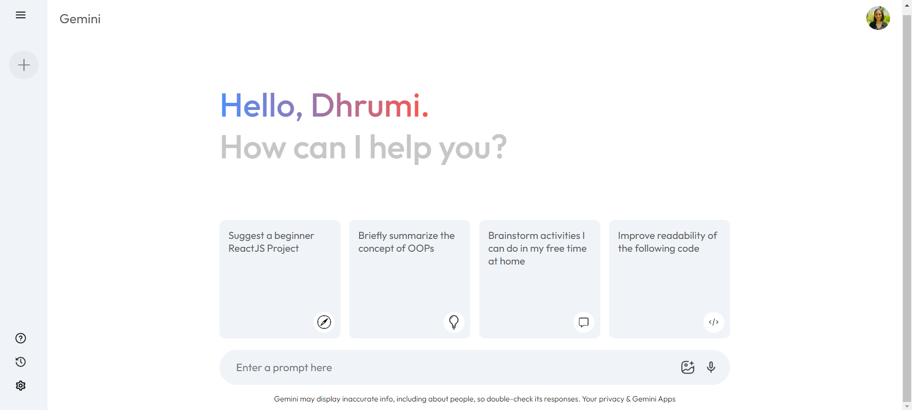
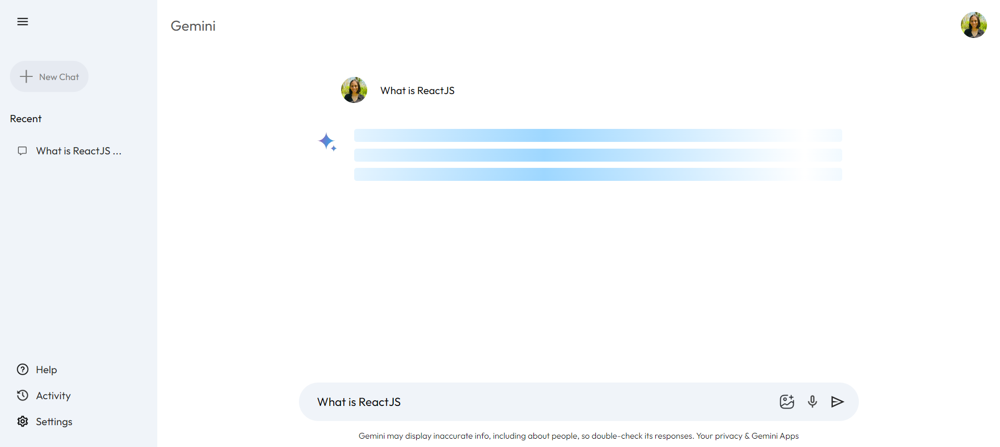

# 🌟 Gemini Clone – ReactJS in Action

Welcome to the **Gemini Clone** project! This is a fully functional replica of Google Gemini, developed using **ReactJS** and the **Google Gemini API**. It showcases modern web development techniques, seamless API integration, and a responsive user interface.

## 📜 Project Overview
This project aims to replicate the core functionalities of the Google Gemini application, including data fetching, interactive user interfaces, and responsive design. It demonstrates the power of **ReactJS** in building scalable and maintainable web applications.

## ✨ Key Features
✅ **Interactive UI:** Dynamic and user-friendly interface built with ReactJS.  
✅ **Real-Time Data Fetching:** Leverages the Google Gemini API to display up-to-date information.  
✅ **Responsive Design:** Optimized for different screen sizes and devices.  
✅ **State Management:** Efficient state handling using React hooks and context API.  
✅ **Smooth Navigation:** Intuitive user experience replicating the Gemini workflow.

## 🖥️ Technologies Used
- **Frontend:** ReactJS, JavaScript, HTML5, CSS3
- **API:** Google Gemini API
- **Version Control:** Git & GitHub
- **IDE:** Visual Studio Code

## 📸 Output Snapshots

### 🏠 Homepage
  
This is the main landing page of the Gemini Clone, showcasing the interface and entry point for the user.

### 📚 Sidebar
  
The sidebar contains navigation options like "New Chat," "Recent Queries," "Settings," and "Help," allowing easy access to features.

### 💬 Prompt Given
  
Demonstrates a user-provided query, showing how the system accepts and handles prompts like "full form of HTML."

### ✅ Response
  
Displays the response section where the Gemini Clone returns answers based on the user's prompt, with clean and formatted output.

### ⏳ History
  
A snapshot of the "Recent" section, displaying previously asked queries such as "What is ReactJS" and "full form of HTML."

## 🏗️ How to Run This Project Locally
```bash
# Clone the repository
git clone https://github.com/DhrumiPrajapati/Gemini_Clone.git
cd GeminiClone

# Install dependencies
npm install

# Start the development server
npm start
```

**Access the application at** `http://localhost:3000`

## 📣 Final Thoughts

The Gemini Clone project is a demonstration of my proficiency in ReactJS, API integration, and modern UI/UX principles. It’s a showcase of clean code, performance optimization, and user-centered design.

I’d love to connect and discuss how I can contribute to innovative web solutions and impactful projects in your team!

## 🔔 Ready to explore more?
Let’s connect and talk about building impactful solutions together!

